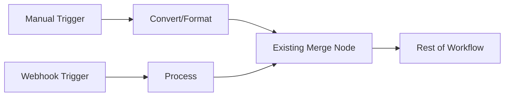
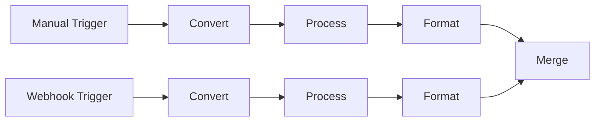

# Node Addition Patterns for AI Agents

## Adding Bypass/Alternative Input Paths

When adding an alternative input method (like manual triggers or test data inputs), follow the **minimal branch pattern**:

### ✅ CORRECT: Minimal Branch Pattern



**Implementation:**
1. Add only the new trigger node
2. Add minimal conversion/formatting if needed
3. Connect to an existing merge point
4. Reuse all existing processing logic

### ❌ INCORRECT: Duplicate Logic Pattern



**Problems:**
- Duplicates existing logic
- Creates maintenance burden
- Makes workflows complex
- Wastes resources

## Implementation Guidelines

### 1. Identify Join Points

Before adding nodes, identify where the new path should join:
- Look for existing Merge nodes
- Find where data formats align
- Choose the earliest sensible join point

### 2. Minimal Conversion

Only add conversion nodes if absolutely necessary:
- Data format differences
- Required field mapping
- Type conversions

### 3. Node Types for Bypass Patterns

**For Manual Input:**
```json
{
  "type": "n8n-nodes-base.manualTrigger",
  "parameters": {},
  "name": "Manual Article Input"
}
```

**For Data Conversion (if needed):**
```json
{
  "type": "n8n-nodes-base.set",
  "parameters": {
    "values": {
      "string": [
        {
          "name": "title",
          "value": "={{ $json.manualTitle }}"
        }
      ]
    }
  },
  "name": "Format Manual Input"
}
```

**Connect to Existing Merge:**
```json
{
  "type": "n8n-nodes-base.merge",
  "parameters": {
    "mode": "append"
  },
  "name": "Merge Inputs"  // Use existing merge node
}
```

## Examples

### Adding Manual News Article Input

**Good Implementation:**
1. Add Manual Trigger node
2. Add Set node to format article to match RSS feed structure
3. Connect to existing "Merge Articles" node
4. No other changes needed

**Bad Implementation:**
1. Add Manual Trigger node
2. Duplicate all processing nodes
3. Create new merge at the end
4. Maintain two parallel processing paths

### Adding Test Data Input

**Good Implementation:**
1. Add Manual Trigger with test data
2. Connect directly to first processing node (if format matches)
3. Use existing workflow entirely

**Bad Implementation:**
1. Create separate test workflow
2. Duplicate validation logic
3. Duplicate processing logic

## Key Principles

1. **Reuse over Recreate** - Always reuse existing nodes when possible
2. **Minimal Surface Area** - Add the fewest nodes necessary
3. **Early Integration** - Join the main flow as early as possible
4. **Single Responsibility** - Each node should do one thing
5. **Maintain Simplicity** - Workflows should be easy to understand

## Common Patterns

### Pattern 1: Alternative Trigger
```
[Alternative Trigger] → [Optional Format] → [Existing Flow]
```

### Pattern 2: Test/Debug Input
```
[Manual Trigger with Test Data] → [Existing First Node]
```

### Pattern 3: Multiple Sources
```
[Source A] ↘
[Source B] → [Merge] → [Process]
[Source C] ↗
```

### Pattern 4: Bypass with Validation
```
[Manual Input] → [Validate] → [Existing Merge] → [Process]
```

## Anti-Patterns to Avoid

1. **Shadow Workflow** - Creating parallel duplicate paths
2. **Logic Duplication** - Copying processing nodes unnecessarily
3. **Late Merging** - Waiting until the end to merge paths
4. **Over-Engineering** - Adding unnecessary conversion/validation
5. **Isolated Branches** - Creating disconnected sub-workflows
6. **Pass-Through Nodes** - Nodes that only pass data without any transformation

### Pass-Through Node Anti-Pattern

**❌ NEVER create nodes like this:**
```json
{
  "type": "n8n-nodes-base.code",
  "parameters": {
    "jsCode": "// Just passing data through\nreturn $input.all();"
  }
}
```

**❌ Or this:**
```json
{
  "type": "n8n-nodes-base.set",
  "parameters": {
    "values": {
      "string": [{
        "name": "data",
        "value": "={{ $json }}"  // Just copying the same data
      }]
    }
  }
}
```

**Why it's bad:**
- Adds unnecessary processing overhead
- Makes workflows harder to read
- Increases execution time
- No functional value

**✅ Instead:**
- Connect directly to the next functional node
- Only add nodes that transform, filter, or process data
- Every node should have a clear purpose

## Decision Framework

When adding a bypass/alternative input:

1. **Q: Does the data format match?**
   - Yes → Connect directly to existing node
   - No → Add single conversion node

2. **Q: Is there an existing merge node?**
   - Yes → Use it
   - No → Add one at the earliest logical point

3. **Q: Do I need to duplicate any logic?**
   - Yes → STOP and reconsider approach
   - No → Proceed

4. **Q: Can I reuse existing nodes?**
   - Yes → Do it
   - No → Justify why not

## Mock Data Pattern

### Store Mock Data in JSON Files

**✅ CORRECT - Mock data in external JSON:**

1. Create JSON file: `workflows/nodes/json/sample_articles.json`
```json
{
  "articles": [
    {
      "title": "Tech Giant Announces AI Toaster",
      "content": "...",
      "score": 9
    }
  ]
}
```

2. Load in JavaScript node:
```javascript
// Reference the external JSON file
const mockData = {
  nodeContent: {
    jsonBody: "sample_articles"
  }
};

// McFlow will inject the JSON during compilation
// In development, you can require the file directly
return mockData.articles;
```

**❌ WRONG - Mock data embedded in JavaScript:**
```javascript
// DON'T DO THIS - Mock data cluttering the code
const sampleArticle = {
  title: "Tech Giant Announces AI Toaster",
  link: "https://example.com/ai-toaster",
  content: "In a surprising move that has left...",
  contentSnippet: "MegaCorp's new AI toaster...",
  pubDate: new Date().toISOString(),
  score: 9,
  reasoning: "Perfect satire of tech...",
  product_ideas: [
    "T-shirt with confused toaster",
    "Mug with 'My toaster thinks I'm depressed'"
  ],
  risk_level: "low",
  market_appeal: "high"
};

return [{ json: sampleArticle }];
```

**Benefits of external JSON files:**
- Cleaner, more readable JavaScript code
- Mock data is reusable across workflows
- Easy to update test data without touching code
- Better version control (data changes separate from logic changes)
- Can be validated with JSON schema tools

## Testing Considerations

When adding bypass paths:
1. Test both paths work independently
2. Test merge handles both inputs correctly
3. Verify no data loss at merge point
4. Ensure consistent output regardless of path

---

**Remember:** The goal is to enhance workflows, not complicate them. When in doubt, choose the simpler approach that reuses existing logic.